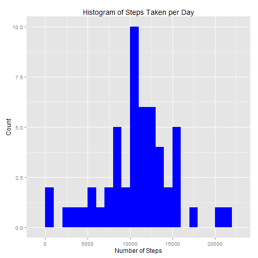
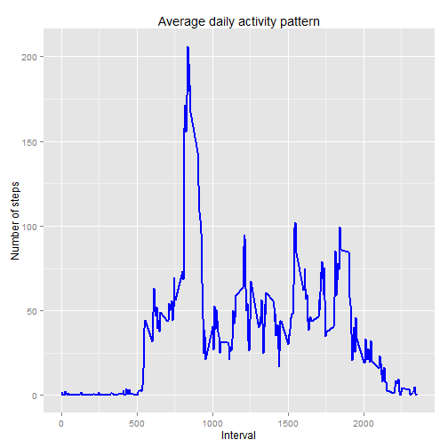
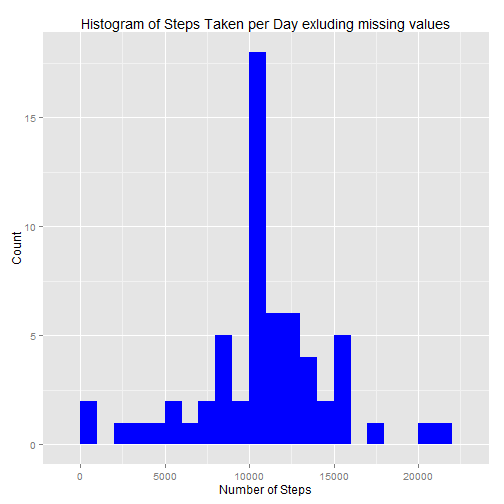
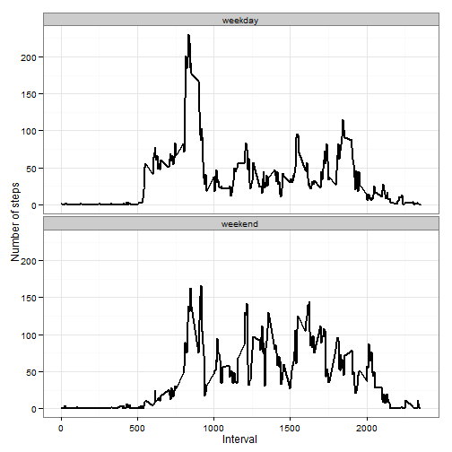

# Reproducible Research: Peer Assessment 1


## Loading and preprocessing the data

Read data from file 

```r
read_data <- function() {
    tbl <- read.csv("C:/Users/narjunan/Documents/02RPR/activity.csv", header = T, 
        colClasses = c("numeric", "character", "numeric"))
    tbl$interval <- factor(tbl$interval)
    tbl$date <- as.Date(tbl$date, format = "%Y-%m-%d")
    tbl
}
tbl <- read_data()
summary(tbl)
```

```
##      steps            date               interval    
##  Min.   :  0.0   Min.   :2012-10-01   0      :   61  
##  1st Qu.:  0.0   1st Qu.:2012-10-16   5      :   61  
##  Median :  0.0   Median :2012-10-31   10     :   61  
##  Mean   : 37.4   Mean   :2012-10-31   15     :   61  
##  3rd Qu.: 12.0   3rd Qu.:2012-11-15   20     :   61  
##  Max.   :806.0   Max.   :2012-11-30   25     :   61  
##  NA's   :2304                         (Other):17202
```


## What is mean total number of steps taken per day?

```r
steps_per_day_fn <- function(tbl) {
    steps_per_day <- aggregate(steps ~ date, tbl, sum)
    colnames(steps_per_day) <- c("date", "steps")
    steps_per_day
}
steps_per_day_data <- steps_per_day_fn(tbl)
# Load ggplot2 function
library(ggplot2)
```

```
## Warning: package 'ggplot2' was built under R version 3.0.3
```

```r
ggplot(steps_per_day_data, aes(x = steps)) + geom_histogram(fill = "blue", binwidth = 1000) + 
    labs(title = "Histogram of Steps Taken per Day", x = "Number of Steps", 
        y = "Count")
```

 

```r
mean_steps <- mean(steps_per_day_data$steps)
median_steps <- median(steps_per_day_data$steps)
```


 Mean and Median number of steps per day 
-  Mean is 1.0766 &times; 10<sup>4</sup>
-  Median 1.0765 &times; 10<sup>4</sup>

## What is the average daily activity pattern?


```r
avg_steps_fn <- function(tbl) {
    avg_steps <- aggregate(steps ~ interval, tbl, mean)
    colnames(avg_steps) <- c("interval", "steps")
    avg_steps
}

avg_steps_data <- avg_steps_fn(tbl)
avg_steps_data$interval <- as.numeric(levels(avg_steps_data$interval)[avg_steps_data$interval])
ggplot(avg_steps_data, aes(x = as.numeric(interval), y = steps)) + geom_line(color = "blue", 
    size = 1) + labs(title = "Average daily activity pattern", x = "Interval", 
    y = "Number of steps")
```

 

```r
max_steps <- avg_steps_data[avg_steps_data[, 2] == max(avg_steps_data$steps), 
    1]
```

Maximum number of steps is 835 


## Imputing missing values


```r
# Function to impute missing values
impute_mean <- function(tbl) {
    na_row <- which(is.na(tbl$steps))
    na_replacement <- sapply(na_row, FUN = function(id) {
        mean(avg_steps_data[avg_steps_data$interval == tbl[id, 3], 2])
    })
    imp_data <- tbl$steps
    imp_data[na_row] <- na_replacement
    imp_data
}

complete_tbl <- data.frame(steps = impute_mean(tbl), date = tbl$date, interval = tbl$interval)
```

The number of rows with missing value 2304


```r
steps_per_day_data1 <- steps_per_day_fn(complete_tbl)
# Load ggplot2 function
library(ggplot2)
ggplot(steps_per_day_data1, aes(x = steps)) + geom_histogram(fill = "blue", 
    binwidth = 1000) + labs(title = "Histogram of Steps Taken per Day exluding missing values", 
    x = "Number of Steps", y = "Count")
```

 

```r
mean_steps <- mean(steps_per_day_data1$steps)
median_steps <- median(steps_per_day_data1$steps)
```

 Mean and Median number of steps per day after exluding missing values
-  Mean is 1.0766 &times; 10<sup>4</sup>
-  Median 1.0766 &times; 10<sup>4</sup>  
Yes there is an impact because of imputing missing values   
The mean and median value have become closer after imputing the missing values and the deviation is reduced. This is due to the fact that skewness is reduced by eliminating missing values in the dataset

## Are there differences in activity patterns between weekdays and weekends?

```r
week_day <- sapply(complete_tbl$date, FUN = function(day) {
    if (weekdays(day) %in% c("Saturday", "Sunday")) {
        "weekend"
    } else {
        "weekday"
    }
})
complete_tbl$week_day <- week_day

avg_steps_wk_fn <- function(tbl) {
    avg_steps_wk <- aggregate(steps ~ interval + week_day, complete_tbl, mean)
    colnames(avg_steps_wk) <- c("interval", "week_day", "steps")
    avg_steps_wk
}
# function to plot weekday vs weekend comparison
new_data <- avg_steps_wk_fn(complete_tbl)

# function to plot weekday vs weekend comparison
ggplot(new_data, aes(x = as.numeric(levels(interval)[interval]), y = steps)) + 
    geom_line(size = 1) + facet_wrap(~week_day, nrow = 2, ncol = 1) + labs(x = "Interval", 
    y = "Number of steps") + theme_bw()
```

 

Activities on weekends are more spread out. While on weekdays activities are concentrated around the 500-1000 interval
